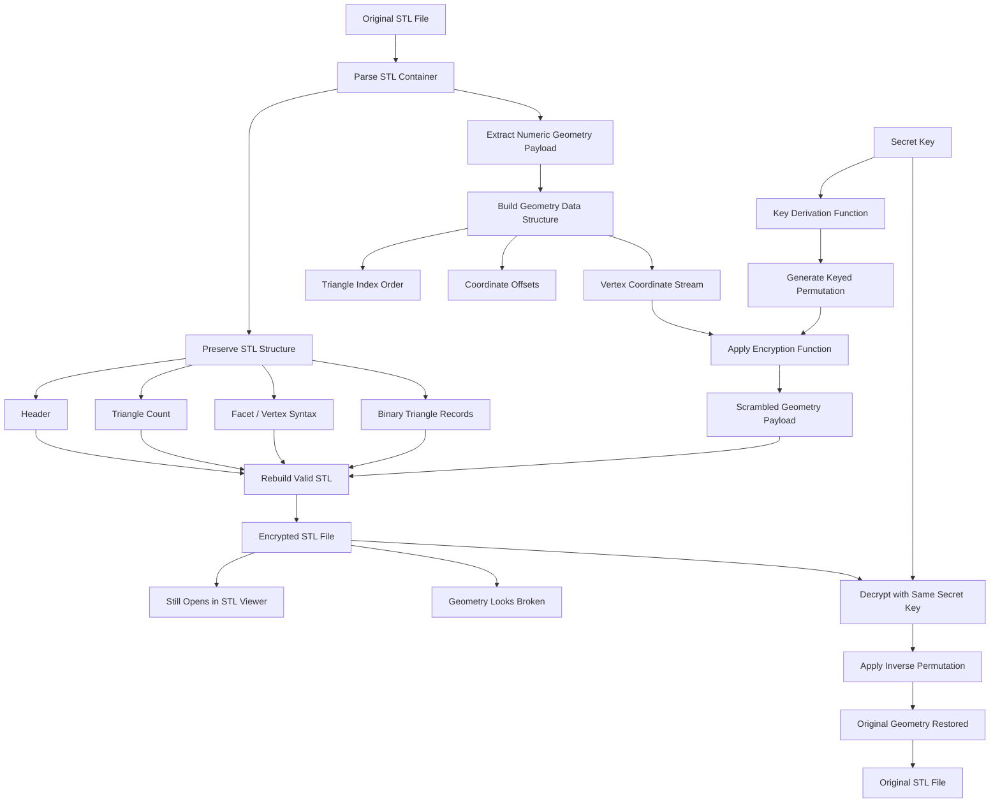

# Encrypted Geometry Stack

## Thesis

A 3D model becomes a programmable economic asset only when Python controls STL encryption/decryption through data structures that decide who can reveal, modify, print, or verify each geometric layer.

## The System

The system converts a 3D STL file into a structured geometry stack: vertices, faces, normals, print layers, support regions, and critical design features are parsed by Python, stored in specialized data structures such as hash maps, Merkle trees, priority queues, and adjacency graphs, then selectively encrypted. Instead of encrypting the whole STL as one blob, the system encrypts each structural component according to its role: outer shell, internal lattice, hidden watermark, mechanical joint, or high-value manufacturing secret. A user with the right key can decrypt only the allowed region, while Python verifies integrity, reconstructs the mesh, detects tampering, and exports a printable STL. The result is not just file protection; it is programmable access control for physical geometry.

## Interdependence proof
Remove Python: The system loses the programmable parser, encryption pipeline, mesh reconstruction logic, permission engine, and STL exporter. The encrypted geometry stack becomes inert data with no execution layer.
Remove 3D STL Encrypt/Decrypt: The system becomes only a mesh-processing tool. It can organize geometry, but it cannot protect intellectual property, control manufacturing access, or selectively reveal printable design regions.
Remove Data Structure: The system collapses into crude whole-file encryption. Without graphs, trees, queues, indexes, and maps, Python cannot separate mesh regions, preserve relationships between faces and vertices, verify integrity, or decrypt geometry by permission layer.

## Failure mode

An attacker steals keys, reconstructs geometry from decrypted print paths, or exploits weak region segmentation to infer hidden internal structures.
A corrupted data structure can break mesh topology, causing decrypted models to become unprintable, unsafe, or geometrically invalid.

## Open question

Can encrypted STL meshes support zero-knowledge proof of printability without revealing the protected geometry?

## Implementation Sketch

The system loads an STL file in Python and separates the file into two layers: the **format layer** and the **geometry layer**. The format layer contains the STL structure itself: header, triangle count, `facet normal`, `outer loop`, `vertex`, `endloop`, and binary triangle records. This layer is preserved so the encrypted STL remains a valid STL file. The geometry layer contains the numeric data: vertex coordinates, normals, triangle positions, and optional region metadata. Only this numeric geometry layer is encrypted.

Python parses the STL into a mesh data structure where vertices, triangles, normals, edges, and regions are stored in structured forms such as arrays, hash maps, adjacency graphs, and Merkle trees. Each triangle is indexed, each vertex is mapped to its connected faces, and each region is grouped by function: outer shell, internal lattice, mechanical joint, support geometry, watermark, or protected design feature. The data structure becomes the control system that decides which numeric values are transformed, in what order, and under which key.

The encryption does not convert the STL into unreadable random bytes. Instead, Python applies a reversible keyed numeric transformation to the coordinates and normals. For example, every vertex coordinate is shifted, rotated, scaled, or noise-distorted using a deterministic key-generated mask. The result is still valid floating-point geometry, so any STL viewer can open it. However, the model appears visually corrupted: surfaces explode, proportions collapse, internal structures scatter, and the object becomes mechanically useless. The encrypted STL is viewable but not manufacturable.

For binary STL files, Python preserves the 80-byte header, triangle count, and 50-byte triangle record structure. It only modifies the 32-bit floating-point numbers representing normals and vertex coordinates. For ASCII STL files, Python preserves all STL keywords and rewrites only the numeric literals after `facet normal` and `vertex`. This guarantees that the encrypted output remains syntactically valid STL.

To decrypt, Python reloads the encrypted STL, rebuilds the same mesh data structures, regenerates the exact numeric masks from the secret key, and applies the inverse transformation. Because every triangle, vertex, and region has a stable index in the data structure, the system knows exactly which numbers to reverse. If the key is correct, the messy encrypted geometry returns to the original printable model. If the key is wrong, the STL remains viewable but geometrically broken.

The system also stores integrity proofs in a Merkle tree so Python can detect whether someone modified the encrypted STL before decryption. If even one triangle’s numeric values are tampered with, the hash proof fails, and the system refuses to reconstruct the original model. This turns the STL into a protected physical design file: visible enough for preview, corrupted enough to prevent theft, and reversible only through the correct key and data-structure-guided decryption.

## Python Implementation
The key design choice is exact reversibility. Instead of adding random noise that can lose precision, the implementation uses keyed permutation plus reversible float-bit masking, so decrypting restores the parsed original numeric values.

It supports:

- ASCII STL
- Binary STL
- Encrypt numeric geometry only: normals + vertex coordinates
- Preserve STL structure so the encrypted STL still opens in STL viewers
- Decrypt back to the original geometry with the same key
- Optional .json metadata for tamper detection

### Usage 
```python stl_geo_crypto.py encrypt input.stl encrypted.stl --key "your-secret-key" --meta encrypted.meta.json```

```python stl_geo_crypto.py decrypt encrypted.stl restored.stl --key "your-secret-key" --meta encrypted.meta.json```

### What the encryption does
It does not encrypt the whole STL file into unreadable bytes.
Instead, it changes only numeric STL geometry values:
```
facet normal 0 0 1
vertex 0 0 0
vertex 1 0 0
vertex 0 1 0
```
becomes something like:
```
facet normal 4.2363520734046972e+138 6.9675664659717658e-14 -5.4166270760467226e+142
vertex -2.1347320960997399e-176 -7.5782214702217579e-280 5.1871051343886708e+284
vertex 2.1468493577292588e-207 -3.0456428035981609e+302 7.6512229503444676e+263
vertex -1.0853001741450191e+69 -1.5212591979644944e-246 -2.8314082858463123e-129
```
The encrypted file remains a valid STL, but the geometry becomes visually broken/messy. Decryption restores the original numeric values using the same key.

```python
#!/usr/bin/env python3
"""
viewer_safe_stl_crypto.py

Viewer-safe STL geometry encryption/decryption.

Core idea:
- Do NOT encrypt the whole STL file into random bytes.
- Keep STL syntax/binary structure valid.
- Encrypt only numeric geometry by keyed permutation of existing coordinate values.
- Because encrypted coordinates are reused from the original file, values stay finite and bounded,
  so normal STL viewers can still open/render the encrypted model.
- Decryption with the same key restores the original geometry exactly for binary STL.

Usage:
  python viewer_safe_stl_crypto.py encrypt input.stl encrypted.stl --key "my-secret" --meta encrypted.meta.json
  python viewer_safe_stl_crypto.py decrypt encrypted.stl restored.stl --key "my-secret" --meta encrypted.meta.json
"""

from __future__ import annotations

import argparse
import hashlib
import hmac
import json
import re
import struct
import sys
from pathlib import Path
from typing import Literal

VERSION = "2.0.0-viewer-safe"
SALT = b"viewer-safe-stl-geometry-crypto-v2"
PBKDF2_ROUNDS = 200_000

Mode = Literal["encrypt", "decrypt"]
Kind = Literal["binary", "ascii"]


class STLCryptoError(Exception):
    pass


def derive_key(passphrase: str) -> bytes:
    if not passphrase:
        raise STLCryptoError("--key cannot be empty")

    return hashlib.pbkdf2_hmac(
        "sha256",
        passphrase.encode("utf-8"),
        SALT,
        PBKDF2_ROUNDS,
        dklen=32,
    )


def hmac_digest(key: bytes, label: bytes) -> bytes:
    return hmac.new(key, label, hashlib.sha256).digest()


def randbelow(key: bytes, label: bytes, upper: int) -> int:
    """
    Deterministic HMAC random integer in [0, upper).
    """
    if upper <= 0:
        raise ValueError("upper must be positive")

    modulus = 1 << 256
    limit = modulus - (modulus % upper)
    counter = 0

    while True:
        digest = hmac_digest(key, label + counter.to_bytes(8, "little"))
        value = int.from_bytes(digest, "big")

        if value < limit:
            return value % upper

        counter += 1


def keyed_permutation(n: int, key: bytes, domain: bytes) -> list[int]:
    """
    Deterministic Fisher-Yates permutation.

    perm[out_index] = source_index during encryption.
    During decryption, source is placed back to perm[in_index].
    """
    perm = list(range(n))

    for i in range(n - 1, 0, -1):
        j = randbelow(
            key,
            domain + b":fy:" + i.to_bytes(8, "little") + b":",
            i + 1,
        )
        perm[i], perm[j] = perm[j], perm[i]

    return perm


def permute_items(
    items: list[bytes | str],
    key: bytes,
    domain: bytes,
    mode: Mode,
) -> list[bytes | str]:
    n = len(items)

    if n == 0:
        raise STLCryptoError("No STL vertex coordinate values found to encrypt/decrypt")

    perm = keyed_permutation(n, key, domain + b":" + str(n).encode("ascii"))
    out: list[bytes | str] = [items[0]] * n

    if mode == "encrypt":
        # encrypted[out_i] = original[perm[out_i]]
        for out_i, src_i in enumerate(perm):
            out[out_i] = items[src_i]

    else:
        # original[perm[in_i]] = encrypted[in_i]
        for in_i, dst_i in enumerate(perm):
            out[dst_i] = items[in_i]

    return out


def detect_stl_kind(data: bytes) -> Kind:
    """
    Binary STL has:
    - 80 byte header
    - 4 byte uint32 triangle count
    - 50 bytes per triangle

    If length exactly matches that structure, treat as binary.
    Otherwise treat as ASCII.
    """
    if len(data) >= 84:
        tri_count = struct.unpack_from("<I", data, 80)[0]
        expected_len = 84 + tri_count * 50

        if expected_len == len(data):
            return "binary"

    return "ascii"


def binary_vertex_offsets(data: bytes) -> list[int]:
    if len(data) < 84:
        raise STLCryptoError("Binary STL is too short")

    tri_count = struct.unpack_from("<I", data, 80)[0]
    expected_len = 84 + tri_count * 50

    if len(data) != expected_len:
        raise STLCryptoError(
            f"Invalid binary STL length: expected {expected_len}, got {len(data)}"
        )

    offsets: list[int] = []

    for tri_i in range(tri_count):
        base = 84 + tri_i * 50

        # Binary STL triangle layout:
        # normal: 3 float32 = 12 bytes
        # vertex 1: 3 float32
        # vertex 2: 3 float32
        # vertex 3: 3 float32
        # attribute byte count: 2 bytes
        #
        # We leave normals unchanged for viewer safety.
        # We only encrypt/scramble the 9 vertex coordinate floats.
        for j in range(9):
            offsets.append(base + 12 + j * 4)

    return offsets


def transform_binary_stl(data: bytes, key: bytes, mode: Mode) -> bytes:
    offsets = binary_vertex_offsets(data)

    # Collect exact 4-byte float32 coordinate payloads.
    # We do not parse/reformat them, so binary decryption is bit-exact.
    values = [data[o:o + 4] for o in offsets]

    shuffled = permute_items(
        values,
        key,
        b"binary-stl-vertex-float32",
        mode,
    )

    out = bytearray(data)

    for offset, chunk in zip(offsets, shuffled):
        out[offset:offset + 4] = chunk

    return bytes(out)


# Numeric token pattern for ASCII STL floats, including scientific notation.
NUM = r"[-+]?(?:\d+(?:\.\d*)?|\.\d+)(?:[eE][-+]?\d+)?"

VERTEX_LINE_RE = re.compile(
    rf"(?im)^([ \t]*vertex[ \t]+)"
    rf"({NUM})([ \t]+)"
    rf"({NUM})([ \t]+)"
    rf"({NUM})([^\r\n]*)(\r?\n?)"
)


def ascii_vertex_token_spans(text: str) -> list[tuple[int, int]]:
    """
    Return spans for numeric coordinate tokens only on ASCII STL vertex lines.
    Keywords and all other file text are preserved.
    """
    spans: list[tuple[int, int]] = []

    for m in VERTEX_LINE_RE.finditer(text):
        spans.append(m.span(2))
        spans.append(m.span(4))
        spans.append(m.span(6))

    return spans


def transform_ascii_stl(data: bytes, key: bytes, mode: Mode) -> bytes:
    try:
        text = data.decode("utf-8")
        encoding = "utf-8"
    except UnicodeDecodeError:
        text = data.decode("latin-1")
        encoding = "latin-1"

    spans = ascii_vertex_token_spans(text)

    if not spans:
        raise STLCryptoError("No ASCII STL vertex lines found")

    tokens = [text[a:b] for a, b in spans]

    shuffled = permute_items(
        tokens,
        key,
        b"ascii-stl-vertex-token",
        mode,
    )

    pieces: list[str] = []
    cursor = 0

    for (a, b), replacement in zip(spans, shuffled):
        pieces.append(text[cursor:a])
        pieces.append(str(replacement))
        cursor = b

    pieces.append(text[cursor:])

    return "".join(pieces).encode(encoding)


def transform_stl(data: bytes, passphrase: str, mode: Mode) -> tuple[bytes, Kind]:
    key = derive_key(passphrase)
    kind = detect_stl_kind(data)

    if kind == "binary":
        return transform_binary_stl(data, key, mode), kind

    return transform_ascii_stl(data, key, mode), kind


def file_hmac(data: bytes, passphrase: str) -> str:
    key = derive_key(passphrase)

    return hmac.new(
        key,
        b"viewer-safe-stl-file-hmac:" + data,
        hashlib.sha256,
    ).hexdigest()


def write_meta(
    path: str | Path,
    *,
    output_data: bytes,
    passphrase: str,
    kind: Kind,
) -> None:
    meta = {
        "tool": "viewer_safe_stl_crypto.py",
        "version": VERSION,
        "kind": kind,
        "method": "keyed permutation of existing STL vertex coordinate values",
        "viewer_safe": True,
        "encrypted_file_hmac": file_hmac(output_data, passphrase),
        "note": (
            "Encrypted STL remains valid and bounded because it reuses existing "
            "coordinate values instead of generating huge random floats."
        ),
    }

    Path(path).write_text(
        json.dumps(meta, indent=2, sort_keys=True) + "\n",
        encoding="utf-8",
    )


def verify_meta(
    path: str | Path,
    *,
    input_data: bytes,
    passphrase: str,
    kind: Kind,
) -> None:
    meta = json.loads(Path(path).read_text(encoding="utf-8"))

    if meta.get("tool") != "viewer_safe_stl_crypto.py":
        raise STLCryptoError("Metadata file was not created by this tool")

    if meta.get("version") != VERSION:
        raise STLCryptoError(
            f"Metadata version mismatch: {meta.get('version')} != {VERSION}"
        )

    if meta.get("kind") != kind:
        raise STLCryptoError(
            f"STL kind mismatch: file={kind}, meta={meta.get('kind')}"
        )

    actual = file_hmac(input_data, passphrase)
    expected = meta.get("encrypted_file_hmac")

    if not hmac.compare_digest(actual, expected):
        raise STLCryptoError(
            "Integrity check failed: wrong key or encrypted STL was modified"
        )


def cmd_encrypt(args: argparse.Namespace) -> None:
    data = Path(args.input).read_bytes()

    output, kind = transform_stl(
        data,
        args.key,
        "encrypt",
    )

    Path(args.output).write_bytes(output)

    if args.meta:
        write_meta(
            args.meta,
            output_data=output,
            passphrase=args.key,
            kind=kind,
        )

    print(f"Encrypted {kind} STL written to: {args.output}")

    if args.meta:
        print(f"Metadata written to: {args.meta}")


def cmd_decrypt(args: argparse.Namespace) -> None:
    data = Path(args.input).read_bytes()
    kind = detect_stl_kind(data)

    if args.meta:
        verify_meta(
            args.meta,
            input_data=data,
            passphrase=args.key,
            kind=kind,
        )

    output, kind = transform_stl(
        data,
        args.key,
        "decrypt",
    )

    Path(args.output).write_bytes(output)

    print(f"Decrypted {kind} STL written to: {args.output}")


def build_parser() -> argparse.ArgumentParser:
    parser = argparse.ArgumentParser(
        description=(
            "Viewer-safe STL geometry encryption/decryption. "
            "Encrypted STL still opens in STL viewers."
        )
    )

    sub = parser.add_subparsers(
        dest="command",
        required=True,
    )

    enc = sub.add_parser(
        "encrypt",
        help="Encrypt STL geometry",
    )
    enc.add_argument("input", help="Input STL file")
    enc.add_argument("output", help="Encrypted STL output file")
    enc.add_argument("--key", required=True, help="Secret key/passphrase")
    enc.add_argument("--meta", help="Optional metadata JSON for integrity checking")
    enc.set_defaults(func=cmd_encrypt)

    dec = sub.add_parser(
        "decrypt",
        help="Decrypt STL geometry",
    )
    dec.add_argument("input", help="Encrypted STL input file")
    dec.add_argument("output", help="Restored STL output file")
    dec.add_argument("--key", required=True, help="Secret key/passphrase")
    dec.add_argument("--meta", help="Optional metadata JSON to verify before decrypting")
    dec.set_defaults(func=cmd_decrypt)

    return parser


def main() -> int:
    parser = build_parser()
    args = parser.parse_args()

    try:
        args.func(args)
        return 0

    except STLCryptoError as e:
        print(f"ERROR: {e}", file=sys.stderr)
        return 2

    except OSError as e:
        print(f"FILE ERROR: {e}", file=sys.stderr)
        return 3


if __name__ == "__main__":
    raise SystemExit(main())
```
### Mermaid diagram


